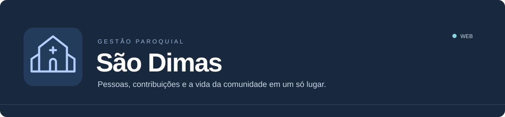
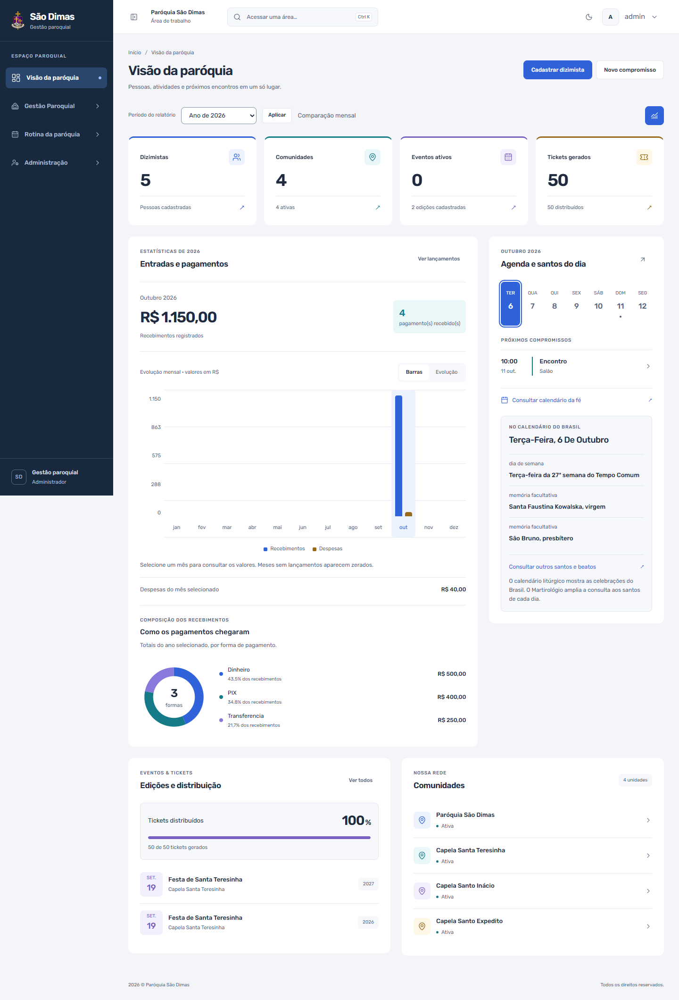
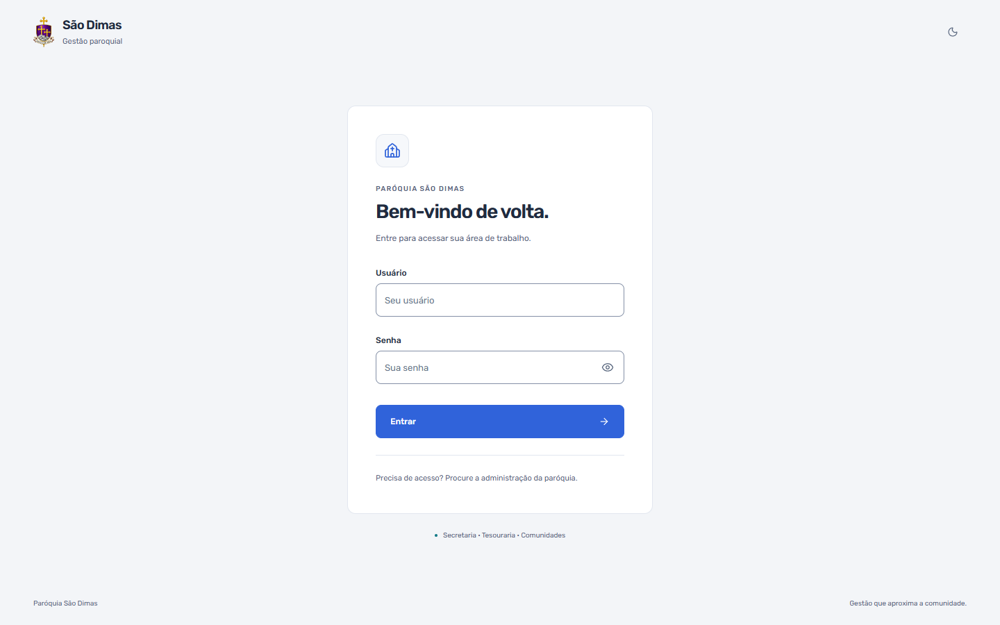
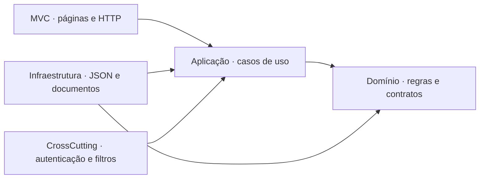

<div align="center">



**Um espaço de trabalho para a secretaria, a tesouraria e as comunidades.**


[Conheça o sistema](#o-sistema) · [Funcionalidades](#funcionalidades) · [Instalação](#instalação-no-windows) · [Desenvolvimento](#desenvolvimento) · [Documentação](#documentação)

</div>

---

## O sistema

O **São Dimas** reúne os cadastros e a rotina administrativa da paróquia em uma aplicação web. Pessoas da secretaria, da tesouraria e da coordenação acessam as áreas permitidas ao seu perfil, com informações compartilhadas e histórico das operações.

O projeto atende à **Paróquia São Dimas** e às capelas **Santa Teresinha**, **Santo Inácio de Loyola** e **Santo Expedito**. Cadastros e movimentos são vinculados às comunidades, permitindo consultas por unidade e uma visão consolidada da paróquia.

A persistência atual utiliza **JSON no servidor**, com gravação atômica e backups. A aplicação funciona sem banco de dados externo; a arquitetura mantém os contratos e as migrações para uma futura integração.

### Uma interface para o trabalho diário

- **Painel com dados reais:** indicadores, gráficos mensais, formas de pagamento, agenda e comunidades.
- **Calendário da fé:** celebrações do Brasil e consulta ampliada ao Martirológio.
- **Temas claro e escuro:** a mesma linguagem visual no computador e no celular.
- **Navegação rápida:** acesso às áreas por `Ctrl + K` ou `Command + K`, respeitando o perfil.
- **Formulários organizados:** seções por contexto, filtros expansíveis e feedback de validação.

<details>
<summary><strong>Veja o dashboard</strong></summary>
<br />



</details>

<details>
<summary><strong>Veja a tela de acesso</strong></summary>
<br />



</details>

<sub>Capturas feitas em ambiente de teste. Os números e registros ilustrados não representam os cadastros reais da paróquia.</sub>

## Funcionalidades

| Área | O que você pode fazer |
| --- | --- |
| **Dizimistas e comunidades** | Cadastrar, editar, pesquisar e consultar pessoas, contatos, endereços, situação e comunidade de referência. |
| **Dízimo e contribuições** | Registrar competência, valor e forma de pagamento; consultar contribuições e emitir recibos. |
| **Financeiro** | Controlar entradas, despesas e comprovantes; consultar totais por período e comunidade, incluindo contribuições e caixa dos eventos. |
| **Eventos e tickets** | Organizar edições anuais, produtos, lotes, distribuição de tickets, prestação de contas e caixa. |
| **Agenda paroquial** | Registrar missas, reuniões e reservas, com validação de conflitos no mesmo espaço. |
| **Secretaria e sacramentos** | Manter registros de batismo, crisma e casamento, com celebrante, livro, folha e termo. |
| **Pastorais e voluntários** | Organizar responsáveis, vínculos, contatos e disponibilidade. |
| **Escalas** | Distribuir serviços e horários dos voluntários, com verificação de sobreposição. |
| **Calendário litúrgico** | Consultar solenidades, festas e memórias do calendário brasileiro, com celebrações móveis calculadas para o ano selecionado. |
| **Documentos e relatórios** | Gerar envelopes de dízimo, tickets, recibos, documentos e relatórios em PDF; exportar dados em CSV. |
| **Importação** | Validar e confirmar lotes em CSV conforme o modelo disponível em cada tela. |
| **Administração** | Gerenciar usuários e perfis, consultar auditoria e criar ou restaurar backups. |

### Acesso por perfil

| Perfil | Áreas principais |
| --- | --- |
| **Administrador** | Todos os módulos, usuários, auditoria e backups. |
| **Secretaria** | Dizimistas, envelopes, contribuições, agenda, sacramentos, pastorais, voluntários, escalas e relatórios permitidos. |
| **Tesouraria** | Dizimistas, envelopes, contribuições, financeiro, agenda e relatórios permitidos. |
| **Coordenador** | Agenda, pastorais, voluntários, escalas e seus relatórios. |

As permissões são verificadas no servidor. O painel, o calendário e as consultas de eventos estão disponíveis aos perfis; a gestão de caixa dos eventos é restrita à administração e à tesouraria.

## Instalação no Windows

### Com o pacote pronto

Para usar em um computador sem ferramentas de desenvolvimento:

1. Extraia o pacote completo em uma pasta gravável, como `Documentos\SaoDimas`.
2. Execute **`INICIAR.bat`**.
3. Aguarde o navegador abrir **http://127.0.0.1:5080**.

O pacote publicado inclui o runtime .NET e os arquivos da interface. O aplicativo roda em segundo plano; executar o BAT novamente reabre o acesso quando o sistema já está funcionando.

```text
SaoDimas/
├── INICIAR.bat       # Inicialização e abertura do navegador
├── SISTEMA/          # Aplicativo e dependências
├── DADOS/            # Cadastros e backups
└── LOGS/             # Diagnóstico de inicialização
```

**Primeiro acesso:** usuário `admin`, senha `admin`. Após entrar, altere a senha e crie contas individuais em **Usuários**.

O pacote se destina a **Windows de 64 bits compatível com .NET 10**. Ele deve ser copiado por inteiro: o BAT sozinho não contém o aplicativo. A inicialização é local, não registra um serviço do Windows e não configura acesso pela rede.

### A partir do código-fonte

Clone o repositório e execute o mesmo inicializador na raiz:

```powershell
git clone https://github.com/NeetoL/SistemaParoquiSaoDimas.git
cd SistemaParoquiSaoDimas
.\INICIAR.bat
```

Na primeira preparação, o BAT baixa **.NET SDK 10** e **Node.js LTS 22**, instala as ferramentas na pasta do projeto, compila os arquivos da interface e publica o aplicativo com runtime incluído. Essa etapa exige internet. As próximas execuções usam a publicação existente.

Os **526 cadastros iniciais de dizimistas** e suas comunidades acompanham o repositório em `dados-iniciais/cadastros.json`. O inicializador os inclui em uma instalação nova ou acrescenta os ausentes em uma instalação existente, preservando os registros atuais e criando uma cópia antes da alteração. Contas, auditoria e movimentações do computador de origem não fazem parte desse arquivo. Para transferir também o histórico de uso, copie a pasta `DADOS`.

→ [Guia completo de instalação e operação no Windows](docs/instalacao-windows.md)

## Dados e continuidade

| Forma de execução | Local padrão dos dados |
| --- | --- |
| Inicializador `INICIAR.bat` | `DADOS/sistema.json` |
| Execução direta do projeto MVC | `SaoDimas.MVC/App_Data/sistema.json` |

O diretório pode ser configurado por `Persistencia:Diretorio` ou pela variável `Persistencia__Diretorio`.

A gravação utiliza um arquivo temporário antes de substituir o principal. Uma cópia anterior e backups diários auxiliam a recuperação. A tela **Backups** permite criar, baixar e restaurar cópias com validação e confirmação; a restauração preserva as contas e a auditoria atuais.

Ao atualizar o aplicativo, preserve a pasta de dados. Mantenha uma cópia de segurança em outro dispositivo e utilize as funções de restauração documentadas.

→ [Como funciona a persistência JSON](docs/persistencia-json.md)

## Desenvolvimento

### Tecnologias

| Camada | Tecnologias |
| --- | --- |
| Aplicação web | .NET 10, ASP.NET Core MVC e Razor |
| Interface | Tailwind CSS 4, JavaScript modular, HTMX e Lucide |
| Tipografia | Rubik Variable servida localmente |
| Persistência ativa | JSON, controle de concorrência e gravação atômica |
| Documentos | QuestPDF |
| Calendário | Romcal com calendário próprio do Brasil |
| Integração futura | Repositórios EF Core e migrações mantidos no projeto |
| Testes | xUnit, testes de calendário em Node.js e verificações de navegador |

### Executar e verificar

Com .NET SDK 10 e Node.js compatível instalados:

```powershell
dotnet restore
dotnet build
dotnet run --project SaoDimas.MVC --launch-profile http
```

O perfil de desenvolvimento HTTP utiliza **http://localhost:5049**. O build prepara os assets do frontend automaticamente.

```powershell
# Testes da aplicação
dotnet test

# Regras do calendário brasileiro
cd SaoDimas.MVC
node --test tests/calendario.test.mjs
```

Para testar operações que alteram dados, configure um diretório JSON isolado. As verificações já realizadas abrangem autenticação, cadastros, concorrência, eventos, tickets, caixa, PDFs, calendário, responsividade e temas.

### Arquitetura



O domínio concentra as regras e não depende da infraestrutura web ou do banco. A aplicação coordena os casos de uso; a infraestrutura implementa persistência e serviços técnicos. O MVC organiza a apresentação e o ponto de composição das dependências.

→ [Detalhamento da arquitetura](docs/arquitetura.md)

## Documentação

| Guia | Conteúdo |
| --- | --- |
| [Gestão paroquial](docs/gestao-paroquial.md) | Uso dos módulos, importações, vínculos e relatórios. |
| [Instalação Windows](docs/instalacao-windows.md) | Inicializador, pacote pronto, dados e logs. |
| [Persistência JSON](docs/persistencia-json.md) | Armazenamento, concorrência, cópias e recuperação. |
| [Autenticação](docs/login.md) | Contas, sessões, permissões e proteção dos acessos. |
| [Eventos, edições e caixa](docs/eventos-edicoes-caixa.md) | Organização e regras do módulo de eventos. |
| [Arquitetura](docs/arquitetura.md) | Camadas, contratos e padrões de implementação. |
| [Design System](docs/design-system.md) | Tokens, temas e componentes compartilhados. |
| [Diretrizes de UI](docs/ui-guidelines.md) | Implementação de interfaces consistentes. |
| [Diretrizes de UX](docs/ux-guidelines.md) | Navegação, formulários, feedback e acessibilidade. |

---

<div align="center">
<strong>São Dimas · Gestão Paroquial</strong><br />
<sub>Organização para a rotina. Continuidade para a comunidade.</sub>
</div>
